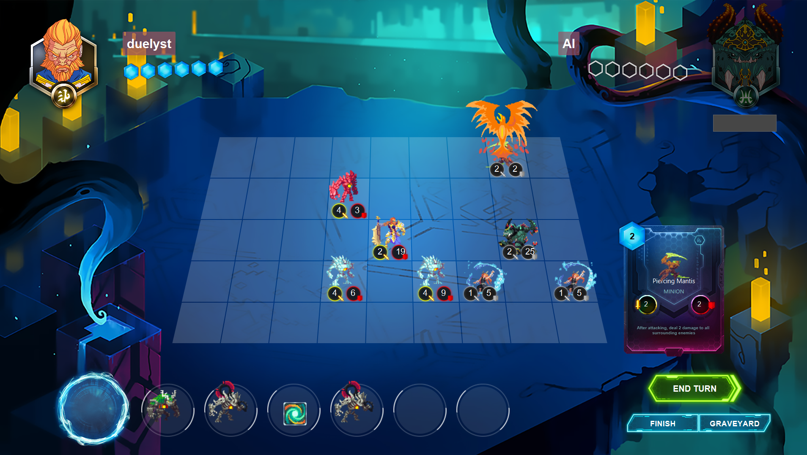

# CardBoard

CardBoard is an open-source project to build a multiplayer collectable-card-game with units that move freely on a battlefield.
The name is a terrible pun; the game has cards, and its played on a board.

The core tech-stack is Java (with Fx) with Python used for scripting and Maven for our build automation. If you are interested in contributing please drop us a message.

### Screenshot

### Building and installing with Maven

1. Import as a maven project (you will need the maven-plugin to do this)
2. Run the command: `mvn clean package`
3. In `Client/target` there should be a file `client-*-shaded.jar`
4. Run the above file and enjoy playing the game!
   - from the command line the run command is `java -jar Client/target/client-*-shaded.jar`

### Building an Executable (Windows)

- Please see the readme in the 'build_exe' directory for instructions.

### Original Project

The Original 'Duelers' Project was created by:

    1. Ahmad Salimi
    2. MohammadMahdi Jarrahi
    3. Mohammad Hadi Esnaashari

...And has been copied under the MIT license.

The original repo can be found here: https://github.com/aps2019project/Duelers

### NOTES:

- Sound effects just work on Windows. On Linux you need to install Glib.

## Licensing

### Code Contributions

Code contributed to Project CardBoard is licensed under the [GNU GPLv3](https://www.gnu.org/licenses/gpl-3.0.html) or later. This includes all code, whether it be Java, Python, or any other language that is currently part of the project or is added in the future. This also includes data files, such as maps, as well as story content.

### Visual and Audio Contributions

All visual and audio assets are licensed under the [Creative Commons BY-SA 4.0](https://creativecommons.org/licenses/by-sa/4.0/). The contributor always retains the full rights to their own work and can continue to use it however they wish.

Unless explicitly stated otherwise, all visual and audio assets that are posted to the [Art](https://projectcardboard.freeforums.net/board/14/art) forum are considered as potential contributions and are automatically placed under the CC BY-SA 4.0.

Visual and audio assets for which you do not own the rights cannot be accepted, nor can any derivative works, nor anything that falls under fair use.
